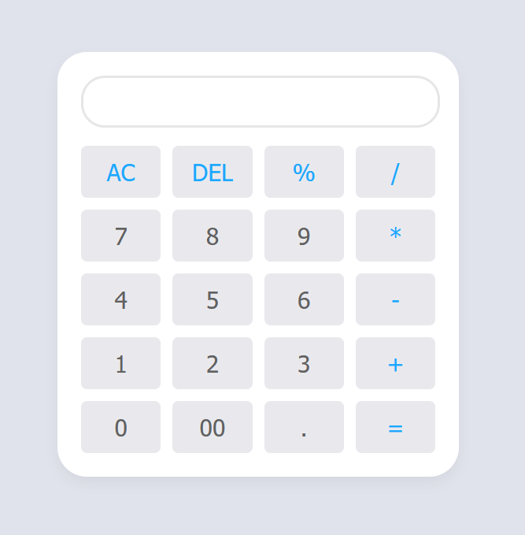

# HTML-CSS-JS-Calculator-

# OUTPUT



A simple web-based calculator built using HTML, CSS, and JavaScript. This calculator allows users to perform basic arithmetic operations such as addition, subtraction, multiplication, and division. It also includes a backspace functionality to remove the last entered digit.

## Features

- Basic arithmetic operations: Addition, Subtraction, Multiplication, Division
- Clear button to reset the calculator
- Backspace button to remove the last character
- Responsive design for various screen sizes

## Technologies Used

- HTML
- CSS
- JavaScript

## Getting Started

To get a local copy of this project up and running, follow these simple steps:

1. Clone the repository:
   ```bash
   git clone https://github.com/yourusername/calculator.git
